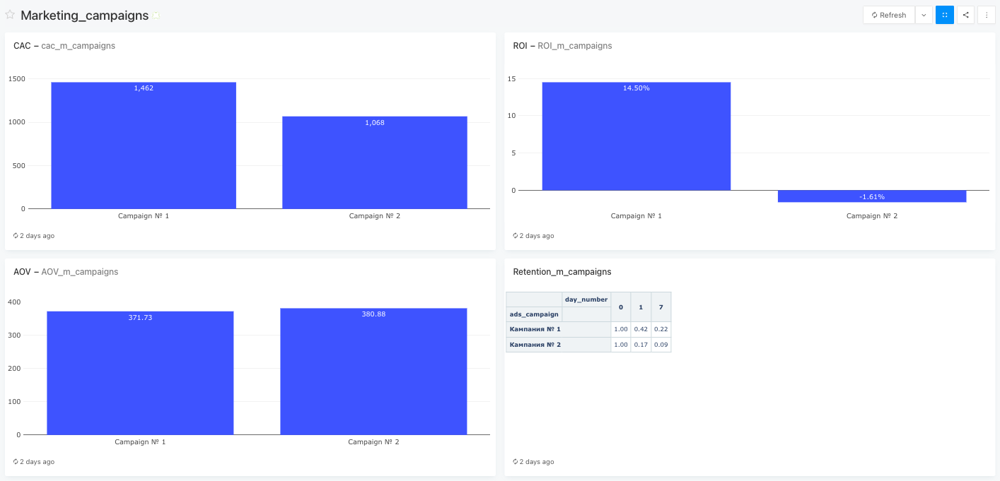
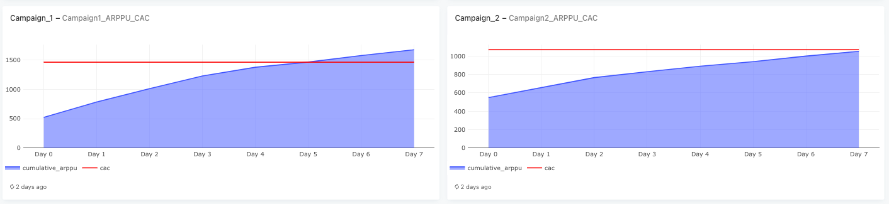

# Marketing Campaign Performance

An end-to-end analytical evaluation of marketing campaign effectiveness, assessing acquisition volume, User CAC, ROI, and Cohort Retention across distinct ad channels using PostgreSQL and Redash.

**Live Dashboard Link:**[View Interactive Dashboard in Redash](https://redash.public.karpov.courses/dashboards/10971-marketing_campaigns)

---

## Tech Stack
* **Database:** `PostgreSQL`
* **BI & Visualization:** `Redash`
* **SQL Techniques:** `Window Functions`, `CTEs`, `Aggregations`
* **Analytical Frameworks:** Unit Economics (`CAC`, `ROI`, `Payback Period`), Cohort Analysis (`Retention Rate`), Monetization Metrics (`AOV`, `Cumulative ARPPU`).
---

## Dashboard Preview

## Campaign Comparison Matrix

| Metric | Campaign 1 (YouTube) | Campaign 2 (Targeted Ads) | Comment |
| :--- | :---: | :---: | :--- |
| **New users** | 171 | **236** | Campaign 2 acquired more users than Campaign 1 |
| **CAC** | 1,462 RUB | **1,068 RUB** | Campaign 2 was cheaper to acquire |
| **ROI** | **+14.50%** | -1.61% | **Campaign 1** generated profit (1.145 RUB per 1 RUB spent) |
| **AOV** | 372 RUB | 381 RUB | Almost equal average order value (~375 RUB) |
| **Day 7 Retention** | **22%** | 9% | **Campaign 1** brought higher quality, loyal users |
| **Payback Period** | **Day 5** | Not achieved (7+ days) | **Campaign 1** broke even within the first week |

---

### Key Takeaways by Dashboard Widgets

### 1. Acquisition & Unit Economics (CAC & ROI)
* **CAC vs Quality:** Campaign 2 had a lower initial CAC (1,068 RUB vs 1,462 RUB), but brought lower-quality traffic
  (see ROI and Retention sections below)
* **ROI Performance:** Campaign 1 achieved a positive ROI of **+14.50%**, while Campaign 2 remained unprofitable at **-1.61%**.

**[SQL Query:  Acquisition & Unit Economics](./sql/01_acquisition_unit_economics.sql)**

### 2. Monetization & User Quality (AOV & Retention)
* **Average Order Value:** AOV is nearly identical across both campaigns (~375 RUB).
* **Retention Driver:** Campaign 1 retention on Day 7 is **22%** compared to only **9%** in Campaign 2. Higher order frequency drove the profit, not higher AOV.

**[SQL Query: AOV & Retention Analysis](./sql/02_aov_retention_analysis.sql)** 

### 3. Payback Period (Cumulative ARPPU vs CAC)
* **Break-even Point:** Cumulative ARPPU for Campaign 1 crossed the CAC line on **Day 5**.
* **Unprofitable Cohort:** Campaign 2 failed to cover its CAC within the 7-day tracking window.

**[SQL Query: Cumulative ARPU & CAC Dynamics](./sql/03_cumulative_metrics.sql)**

---

## Executive Summary & Recommendation

* **Final Verdict:** Despite higher initial acquisition in Campaign 2, **Campaign 1 was significantly more successful** due to strong retention and fast payback.
* **Business Recommendation:** It is recommended to reallocate budget from Campaign 2 (Targeted Ads) toward scaling Campaign 1 (YouTube Influencers) due to superior ROI and retention.

